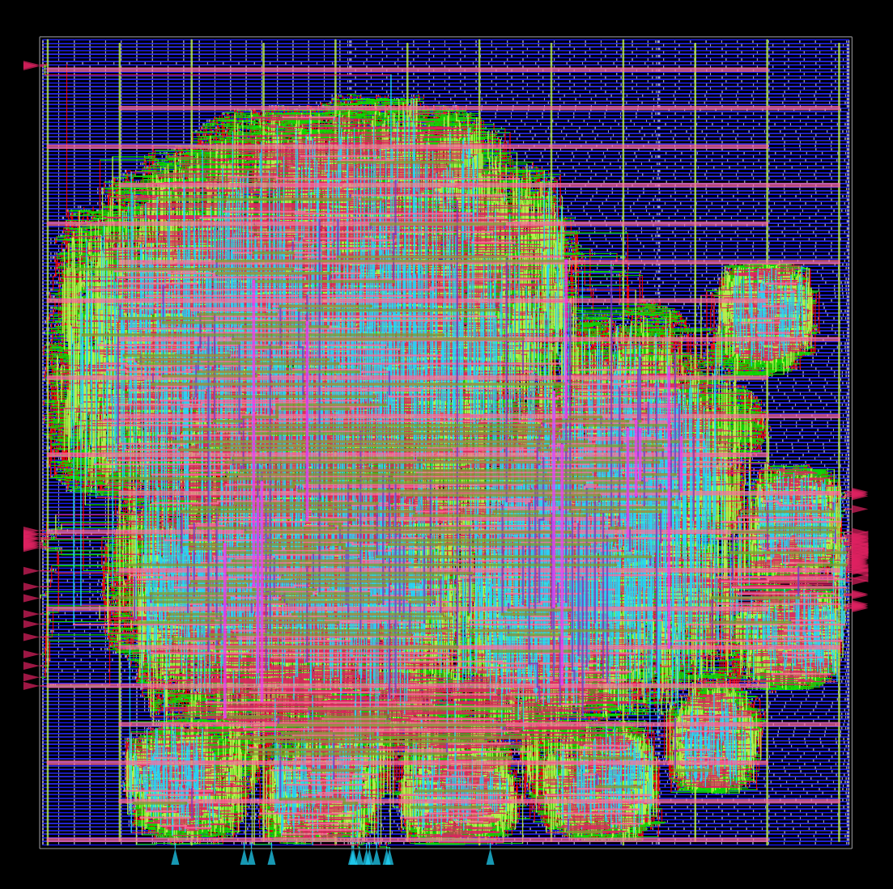
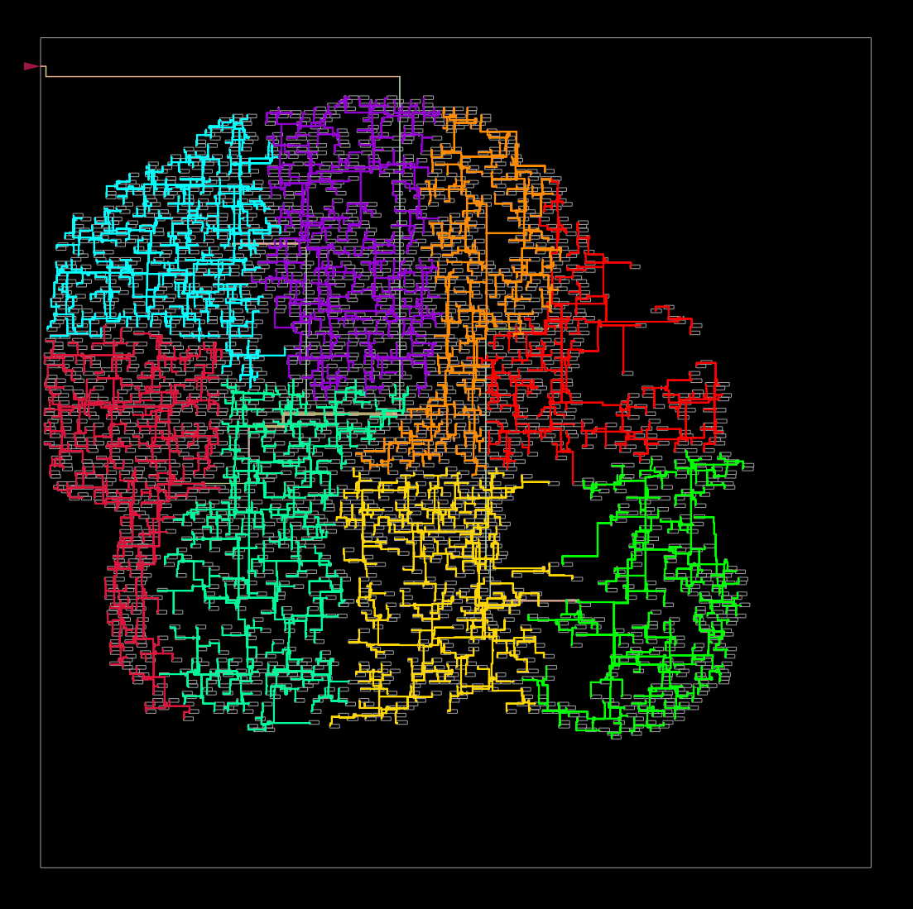
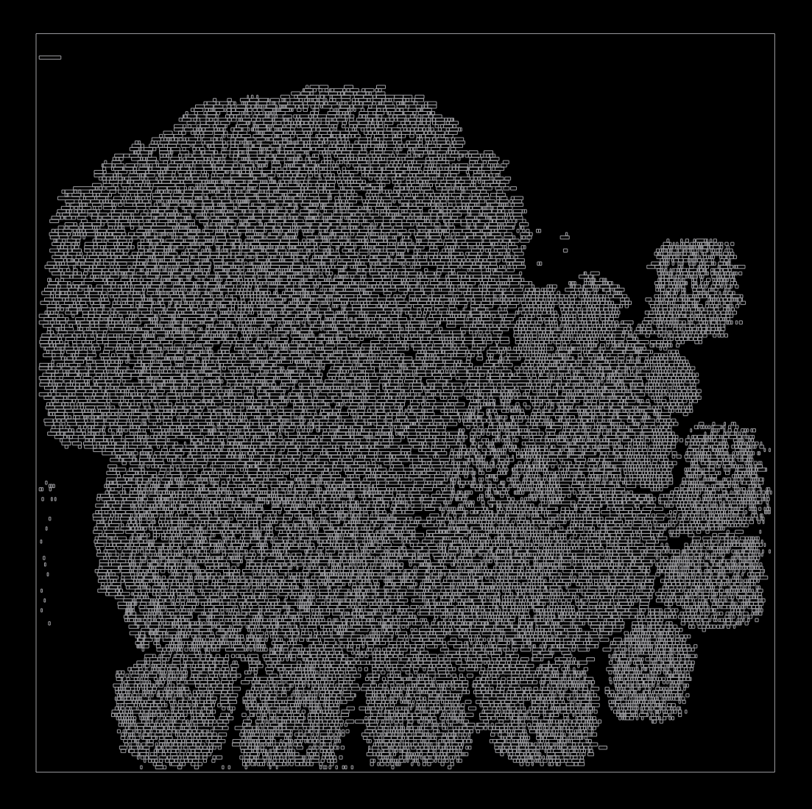
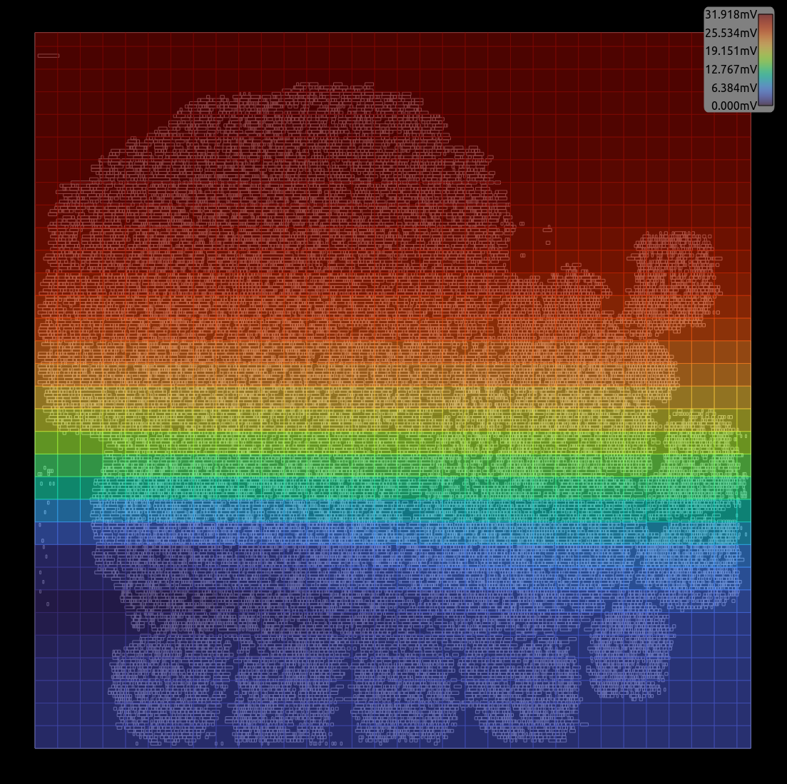

# AES-128/256 RTL-to-GDSII Digital Implementation Flow

这是一个基于开源 EDA 工具链（Yosys + OpenROAD + KLayout）实现的 AES 加密处理器数字后端设计项目。本项目不仅展示了完整的自动化流程，还提供了针对 Nangate45 工艺节点的**分步物理实现脚本**，用于精细的时序修复和布线优化。

---

## 💎 项目亮点 (Highlights)

* **全流程覆盖**：从 RTL 源代码，经过逻辑综合，到最后的 GDSII 导出及 LVS 验证。
* **分步物理实现**：提供 5 个独立控制的 Tcl 脚本，允许在 Floorplan、Placement、CTS 和 Routing 阶段进行手动干预和参数调优。
* **Sign-off 级别验证**：包含寄生参数提取 (SPEF) 和布局对比验证 (LVS)，确保设计具备制造可行性。
* **可视化分析**：包含详细的电源完整性 (IR Drop)、时钟树分布及布线密度的可视化报告。

---

## 📂 目录结构 (Directory Structure)

```text
.
|   .gitattributes
|   .gitignore
|   aes.core
|   config.mk
|   constraint.sdc
|   Makefile
|   README.md
+---docs/
|       terminal.txt
+---reports/
|       final_all.webp.png
+---results/
|       6_final.gds
|       6_final.spef
|       6_final.v
|       6_lvs.lvsdb
+---scripts/
|       2_floorplan_to_pdn.tcl
|       3_placement.tcl
|       4_clock_tree_synthesis.tcl
|       5_routing.tcl
|       aes_secworks_def2stream.py
+---src/
|       aes.v
|       aes_core.v
|       aes_decipher_block.v
|       aes_encipher_block.v
|       aes_inv_sbox.v
|       aes_key_mem.v
|       aes_sbox.v
|       LICENSE
+---syn/
        aes_secworks.ys
```

---

## 🛠️ 自动化流程 (Automated Flow)

本项目通过精心设计的 `Makefile` 实现了全自动化的 Push-button Flow。只需一个命令即可完成所有步骤。

### 一键执行全流程
```bash
# 自动依次执行：综合 -> 布局 -> 布线 -> 导出 GDS
make

```
## 🚀 分步优化流程 (Design Flow)

### 1. 逻辑综合 (Logic Synthesis)
使用 **Yosys** 将 RTL 映射到 Nangate45 标准单元库。
* **脚本**: `syn/aes_secworks.ys`
* **关键产物**: `aes_synth.v` (门级网表)

### 2. 物理实现 (Physical Implementation)
进入 **OpenROAD** 环境，按顺序执行以下分步脚本。每一步都会保存中间 `.odb` 数据库以便调试：

| 阶段 | 脚本名称 | 关键操作描述 |
| :--- | :--- | :--- |
| **P1** | `2_floorplan_to_pdn.tcl` | 定义芯片面积、IO 引脚分配及电源网络 (PDN) 生成。 |
| **P2** | `3_placement.tcl` | 包含全局放置、时序驱动的 Resize 优化及详细放置。 |
| **P3** | `4_clock_tree_synthesis.tcl` | 时钟树综合、反相器修复及时钟偏斜 (Skew) 平衡。 |
| **P4** | `5_routing.tcl` | 全局与详细布线，包含天线效应修复及寄生参数估算。 |
| **P5** | `aes_secworks_def2stream.py` | 使用 **KLayout** 将 DEF 转换为最终制造用的 GDSII 版图。 |

---

## 📊 结果展示 (Implementation Results)

### 物理布局图 (Physical Layout)
通过 KLayout 导出的最终全层布线版图。


### 时钟树分布 (Clock Tree Distribution)
展示了 AES 核心时钟网络的扇出和路径平衡。


### 单元放置热力图 (Placement Density)
显示了标准单元在核心区域的分布密度，确保无拥塞风险。


### 电源质量分析 (IR Drop Analysis)
静态电源网络分析，确保电压降在安全范围内。


---

## ✅ 验证报告 (Verification)

* **DRC (Design Rule Check)**: 经过详细布线修复，完全符合 Nangate45 物理设计规则。
* **LVS (Layout Vs Schematic)**: 通过比对，版图连线与逻辑网表完全一致。验证记录见 `results/6_lvs.lvsdb`。
* **Timing**: 时序成功收敛，最终 Slack 满足设定要求（10ns 周期）。详细统计见 `reports/6_finish.rpt`。

---

## 🛠️ 如何运行 (Usage)

本项目推荐在容器化环境中运行（如 OpenLane 或 ORFS 镜像）。

完善中（ing）

---
## 📜 许可证 (License)

* **设计脚本 (Design Scripts)**: 本项目后端实现脚本基于 **BSD 3-Clause License**。
* **AES IP 核心 (AES IP Core)**: 源代码版权归原作者 **Secworks Sweden AB** 所有。请参阅 `src/LICENSE` 文件以获取详细的授权条款。

---
